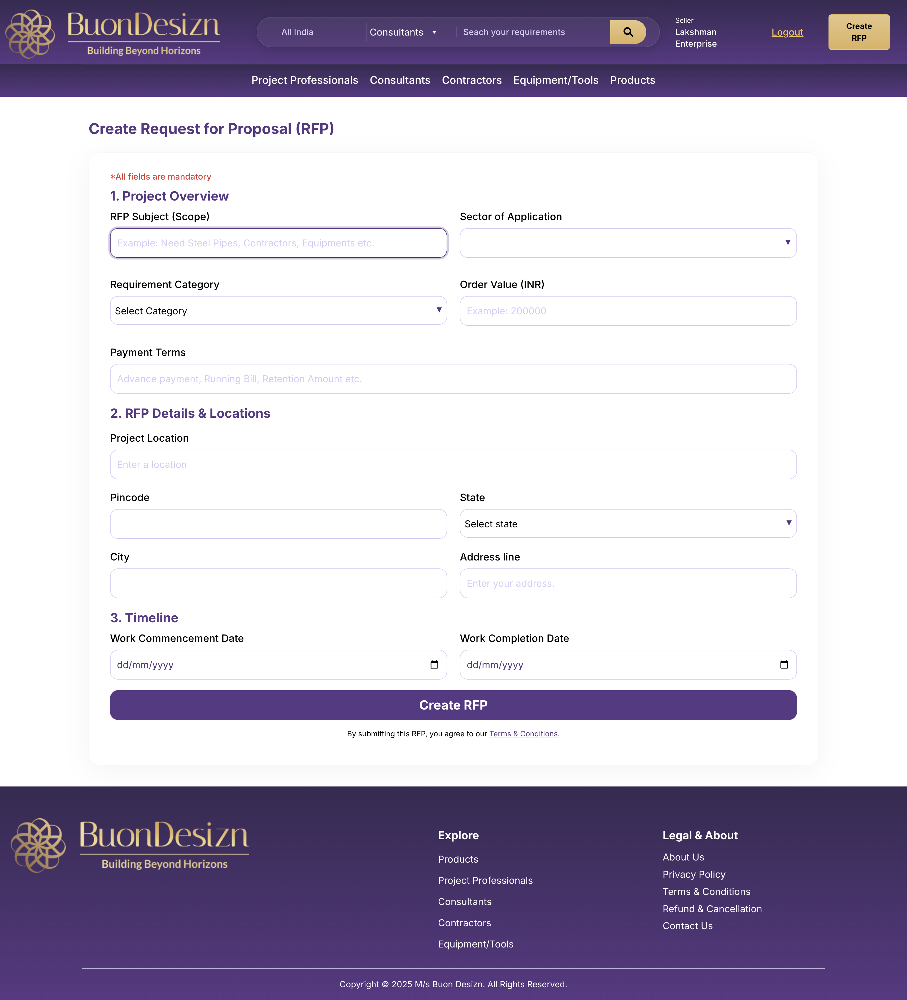

# Legacy Audit: RFP Creation Flow

This document details the "Create RFP" process in the legacy UAT system, establishing the functional baseline for the new platform.

## 1. Project Overview (Mandatory)
| Field | Type | Legacy Placeholder / Example | Requirement |
|-------|------|------------------------------|-------------|
| RFP Subject | Text | "Need Steel Pipes, Contractors..." | Mandatory |
| Sector of Application | Search Select | "Search ▼" | Mandatory |
| Requirement Category | Select | "Select Category ▼" | Mandatory |
| Order Value (INR) | Number | "Please enter a valid number" | Mandatory |
| Payment Terms | Textarea | "Advance, Running Bill, Retention etc." | Mandatory |

## 2. Details & Locations
| Field | Type | Legacy Placeholder / Example | Requirement |
|-------|------|------------------------------|-------------|
| Project Location | Text | "Enter a location" | Mandatory |
| Pincode | Number | - | Mandatory |
| State | Select | "Select state ▼" | Mandatory |
| City | Text | - | Mandatory |
| Address line | Text | "Enter your address." | Mandatory |

## 3. Timeline
| Field | Type | format |
|-------|------|--------|
| Work Commencement | Date Picker | DD / MM / YYYY |
| Work Completion | Date Picker | DD / MM / YYYY |

## Visual Baseline

## Gap Analysis & Modernization Strategy
1. **Validation**: Legacy validation is basic. New system will enforce GSTIN-linked verification before RFP broadcast.
2. **Proximity**: Legacy uses static address fields. New system will integrate Leaflet for precise geocoding.
3. **Drafting**: No "Save as Draft" visible in legacy; mandatory for new platform.
