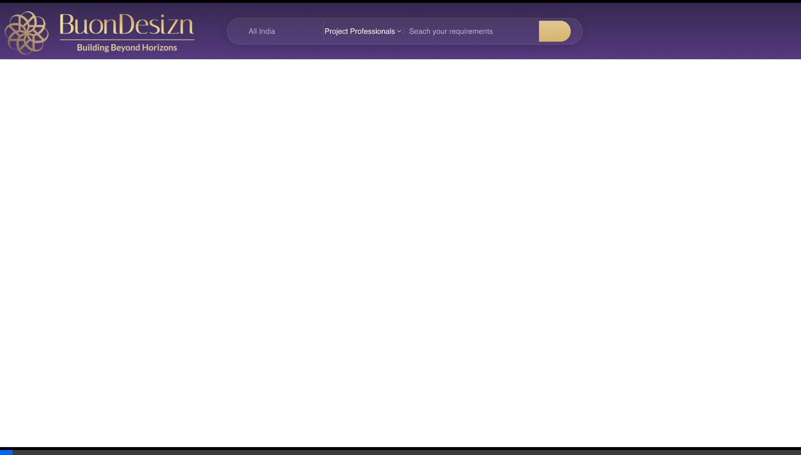
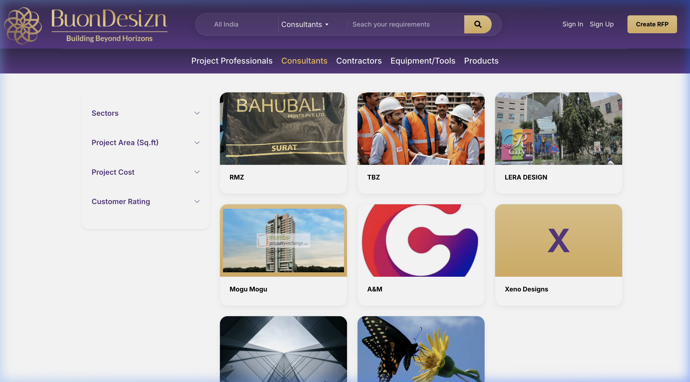
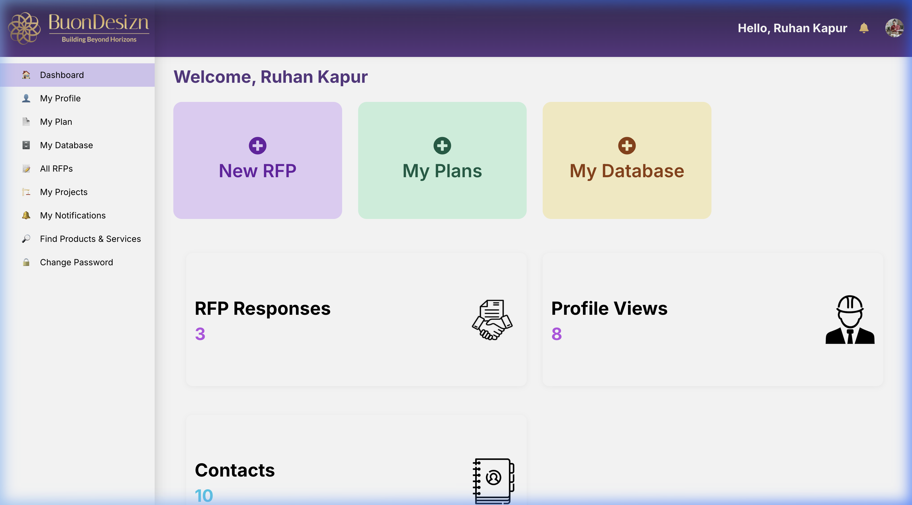
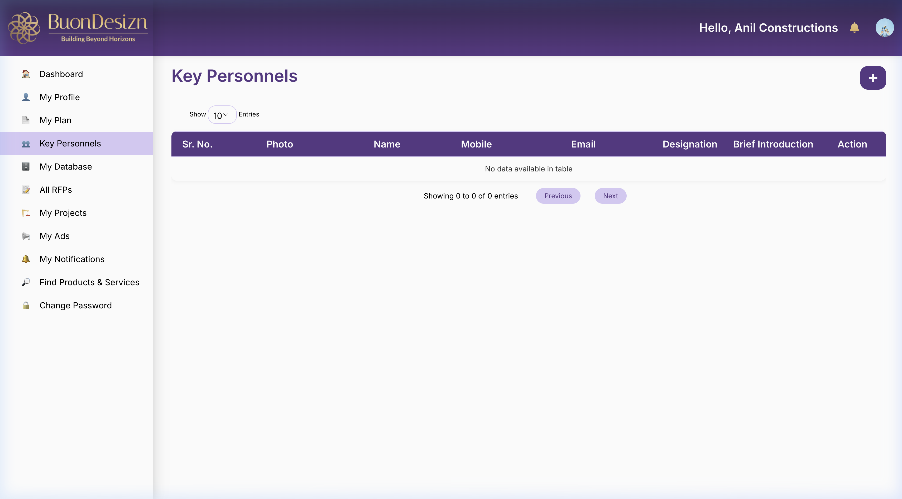
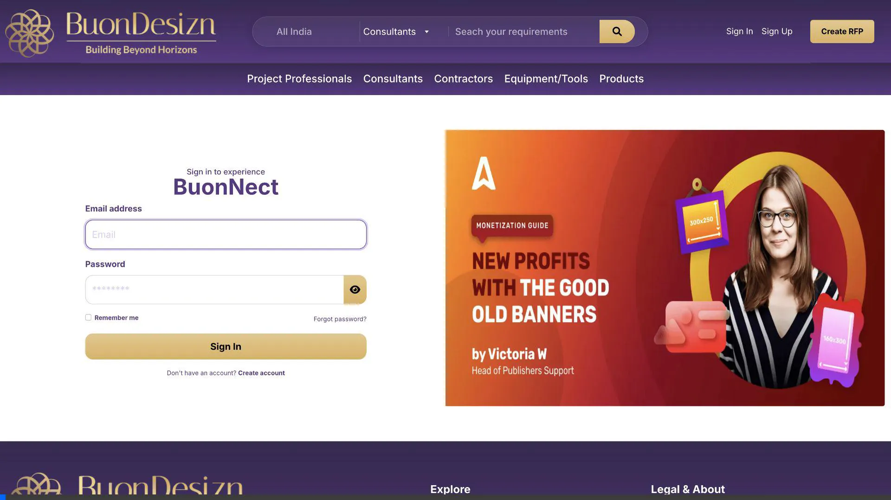

# Legacy Roles Baseline Audit - BuonDesizn UAT

This document is a consolidated reference of the visual and functional audit of the legacy `uat.buondesizn.com` system, capturing the **"Bare Minimum"** UI/UX expectations for all roles and the guest discovery state.

---

## 1. Guest Discovery State (Non-Authenticated)

The guest experience focuses on marketplace legitimacy and discovery.

### A. Navigation & Landing Page
- **Global Search**: Search bar with Location, Role, and Keyword inputs.
- **Role Sliders**: Horizontal carousels for "Popular" Project Professionals, Consultants, Contractors, Product Sellers, and Equipment Dealers.
- **Trust Indicators**: Live counters for BuonNects (Connections), Verified Professionals, and Leads.

### B. Search Results
- **Profile Cards**: Information grid (Logo/Photo, Name, Role).
- **Privacy Wall**: "View Contact" triggers a mandatory login modal. Email and phone numbers are masked in preview.

````carousel

<!-- slide -->

````

---

## 2. Authenticated Sidebar Baseline (All Roles)

Regardless of the role, the following core features are always present:
- **Dashboard**: Central operations hub.
- **My Profile**: Identity and professional settings.
- **My Plan**: Subscription & credit management.
- **My Database**: Historical record of accepted handshakes/connections.
- **My Notifications**: Alert center for marketplace activity.
- **Find Products & Services**: Global discovery gateway.
- **Change Password**: Account security.

---

## 3. Role-Specific Deep Dive

### A. Project Professional (PP) & Consultant (C)
- **Primary Focus**: RFP management and project leadership.
- **Dashboard Metrics**: RFP Responses, Profile Views, Contacts established.
- **Unique Menus**: `My RFPs`, `All RFPs`, `My Projects`.



### B. Contractor (CON)
- **Primary Focus**: Execution, team management, and portfolio.
- **Dashboard Metrics**: Active Projects, Key Personnels (Count), Profile Impressions.
- **Unique Menus**: `Key Personnels`, `My Projects`.



### C. Product Seller (PS) & Equipment Dealer (ED)
- **Primary Focus**: Catalog management and inbound lead response.
- **Dashboard Metrics**: Product/Equipment Views, Enquiries/Requests (Count), Contacts.
- **Unique Menus**: `My Products` / `My Equipment`, `Enquiries` / `Requests`, `My Ads`.



---

## 4. Settings & Profile Baseline (Mandatory Fields)

- **Identity**: Full Name, Designation, Organisation Name.
- **Contact**: Email, Mobile, Mode of Contact (Email, Call, or Both).
- **About**: "About Myself" professional summary.
- **Branding**: Logo/Profile Picture upload (Supports up to 5MB).

---

## 5. UI/UX "Bare Minimum" Summary Table

| Element | Minimal Expectation | Improvement Strategy |
| :--- | :--- | :--- |
| **Sidebar** | Persistent left-nav | Collate into Management/Marketplace categories. |
| **Dashboard** | 4-card metric summary | Real-time DQS ticker and handshake charts. |
| **Search** | 3-column card grid | Glassmorphic cards with "Trust Badges." |
| **Privacy** | Masking with asterisks | Server-side RLS triggers upon handshake. |
| **Key Personnel** | Single-field JSON (Loose) | GSTIN-linked `company_personnel` table with **Company DNA** reveal. |

> [!IMPORTANT]
> **Consolidation Note**: This file replaces the fragmented role documentation as the definitive source of truth for Phase 1 development parity.
