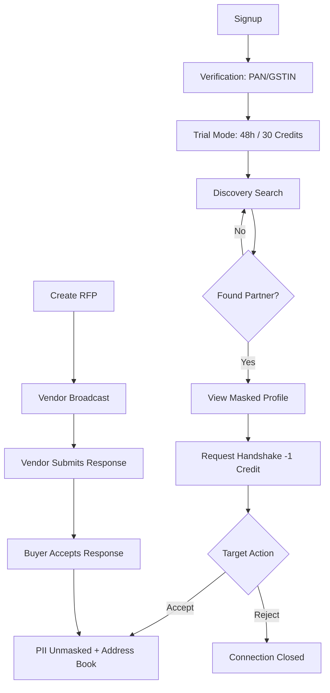
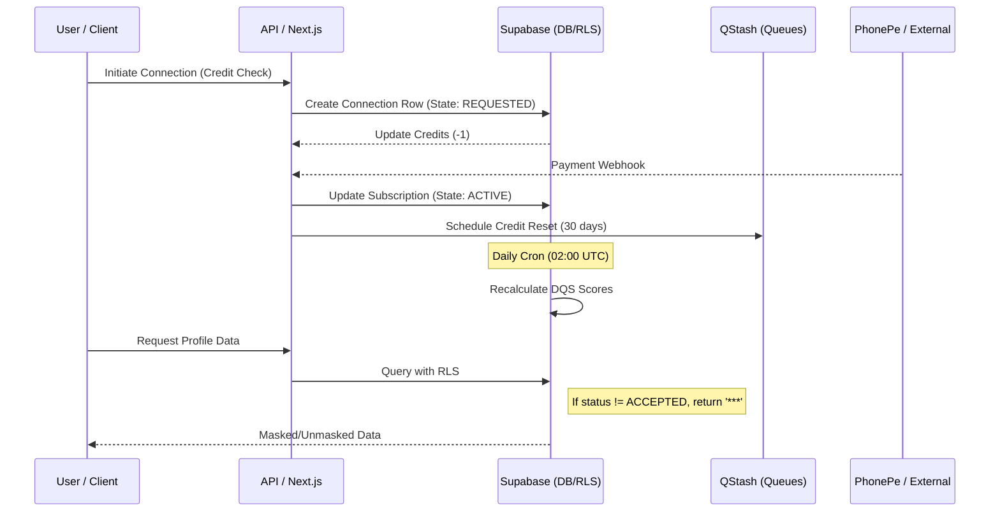

# BuonDesizn B2B Marketplace: Flow Documentation

This document provides a detailed breakdown of the **User Flow** (user-focused) and **Process Flow** (system-focused) for the BuonDesizn B2B Marketplace.

---

## 👉 User Flow Document (User-Focused)

This flow describes the journey of a user (Architect, Contractor, Supplier) from onboarding to successful connection and procurement.

### 1. Onboarding & Identity Discovery
*   **Registration**: User signs up and selects a primary role (PP, CON, C, PS, or ED).
*   **Verification**: User provides **PAN** (Individual) or **GSTIN** (Company).
*   **Trial Start**: Automatically enters a **48-hour trial** with 30 handshake credits.
*   **Discovery**: User searches for professionals/suppliers. 
    *   *Experience*: Results are sorted by **70% Quality (DQS) / 30% Proximity (Distance)**.
    *   *Privacy*: Profiles are shown with **masked PII** (Phone, Email, LinkedIn are hidden).

### 2. The Handshake Journey (Trust Escalation)
*   **Initiate**: User finds a potential partner and clicks "Connect" or "Book Handshake".
*   **Cost**: Costs **1 Credit**. The state moves to `REQUESTED`.
*   **Response**: The target user receives a notification.
    *   **Accept**: Target clicks "Accept". State moves to `ACCEPTED`.
    *   **Reject**: Target clicks "Decline". State moves to `REJECTED`.
*   **Outcome**: If accepted, the seeker can now see the target's **Mobile Number and Email**. The contact is saved in their **Address Book** for permanent access.

### 3. RFP & Response Flow
*   **Create RFP**: Buyer (e.g., Architect) creates a Request for Proposal (RFP) for a project.
*   **Broadcast**: System notifies matched vendors within the search radius.
*   **Submit Response**: Vendors submit their bids/responses.
*   **Accept Response**: Buyer reviews and accepts a response. This **automatically triggers a Handshake** (at no additional credit cost).
*   **Unmasking**: Both parties' PII is revealed to each other.

### 4. Subscription & Access
*   **Payment**: After 48 hours, the user must pay via **PhonePe** to move to `Active`.
*   **Hard Lock**: If no payment is made by H+49, the account is `hard_locked` (Discovery and Handshakes are disabled).
*   **Renewal**: Monthly reset of 30 credits.

### 📊 User Journey Diagram

---

## 👉 Process Flow Document (System-Focused)

This flow describes the internal system logic, state transitions, and event orchestration.

### 1. Privacy & Masking Engine (RLS)
*   **Default State**: `public.profiles` PII columns are protected by Row Level Security (RLS).
*   **Unmasking Trigger**: An `ACCEPTED` handshake status in the `connections` table.
*   **Audit Trail**: Every unmasking event triggers a write to `public.unmasking_audit`.
*   **Company DNA Sync**: If a User belongs to a Company (GSTIN), unmasking one representative unmasks all associated personnel for that seeker via a Postgres Join/Policy.

### 2. Handshake State Machine (FSM)
*   **States**: `MASKED` → `REQUESTED` → `ACCEPTED` | `REJECTED` | `EXPIRED` (30 days).
*   **Guards**:
    *   Check `handshake_credits >= 1`.
    *   Check `subscription_status != 'hard_locked'`.
*   **System Action**: On `ACCEPTED`, the system atomically inserts into `address_book` and `unmasking_audit`.

### 3. Subscription & Job Orchestration (QStash)
*   **Trial Expiry**: At registration, a **delayed QStash job** depends on `trial_started_at + 49h`.
*   **Hard Lock Trigger**: If `subscription_status` is not `active` when the job fires, it pushes the profile into `hard_locked`.
*   **Payment Webhook**: PhonePe hits `/api/webhooks/phonepe`.
    *   System validates signature.
    *   Updates `subscriptions` table.
    *   Emits `SUBSCRIPTION_ACTIVATED` event.
    *   Resets `handshake_credits`.

### 4. DQS Ranking Logic (Daily Batch)
*   **Trigger**: `pg_cron` at 02:00 UTC daily.
*   **Formula**: `(0.4 * Responsiveness) + (0.3 * Trust Loops) + (0.2 * Verification) + (0.1 * Depth)`.
*   **Responsiveness**: Average time between `REQUESTED` and `ACCEPTED/REJECTED`.
*   **Trust Loops**: Total count of unique `ACCEPTED` connections.

### 5. Media & Storage
*   **Signed URLs**: Project drawings/attachments are served via Supabase Storage with a **60-minute TTL**.
*   **Moderation**: Ad images are scanned via **Sightengine** before status set to `ACTIVE`.

### 📊 System Orchestration Diagram

---

## Key References
*   **Spec ID-001**: Identity & GSTIN Linking.
*   **Spec HD-001**: Handshake Protocol.
*   **Spec MON-001**: Subscription & Hard Lock.
*   **Spec RM-001**: DQS Ranking Formula.
